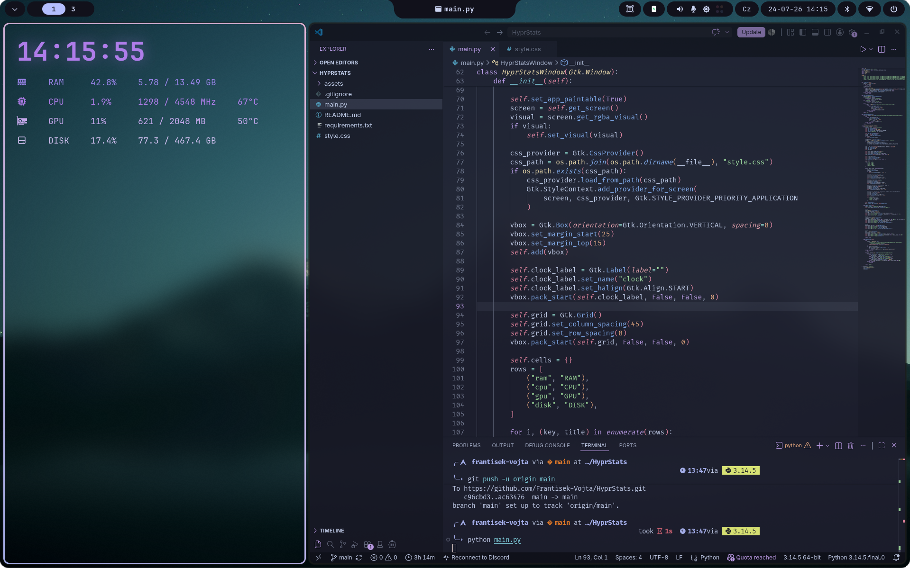

<div align="center">

# HyprStats

Custom Linux desktop system monitor widget for Hyprland on Arch Linux.




*more screenshots coming soon.*
</div>

---

## Features

- Real-time RAM, CPU, GPU, and DISK usage monitoring
- Live CPU and GPU temperature readouts
- Transparent purple-themed UI with GTK3 CSS styling
- High-load notifications via notify-send
- Embedded Font Awesome icons rendered with cairosvg

## Status

This project is in early development. 

<div align="center">


</div>

## Requirements

- Python 3.9+
- GTK3 (PyGObject)
- psutil
- cairosvg
- Nerd Font (for terminal icons, optional)

## Installation

Install system dependencies (Arch Linux):

```bash
sudo pacman -S python-gobject python-psutil python-cairosvg
```

Clone the repository:

```bash
git clone https://github.com/Frantisek-Vojta/HyprStats.git
cd HyprStats
```

Install Python dependencies:

```bash
pip install -r requirements.txt
```

## Usage

Run the widget:

```bash
python main.py
```

## Contributing

Pull requests, bug reports, and feature requests are welcome. Feel free to open an issue.

## License

This project is licensed under the MIT License.
